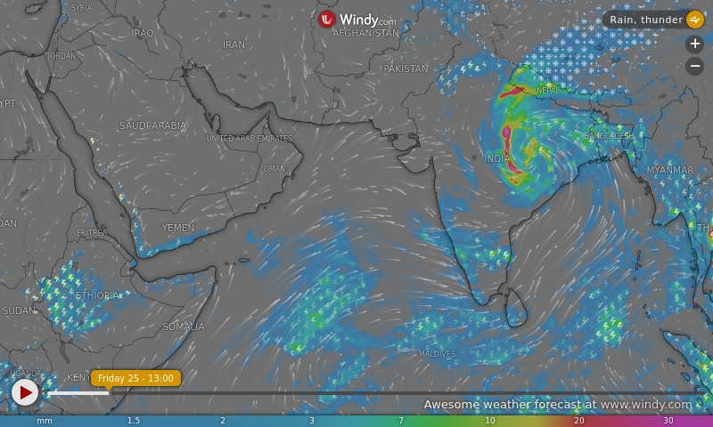

# Weather Dashboard



Grabs a [Windy](https://www.windy.com/) rain map every hour and turns it into an image an ESP32 display can show directly.

## What it does

1. `windy.html` embeds the Windy map — rain overlay, ECMWF model, sized to 800×480.
2. A GitHub Action opens that page in a headless browser and screenshots it to `windy.jpg`.
3. The screenshot is converted to `windy.bin` — raw RGB565 pixels with a 4-byte LVGL header, ready to load on an LVGL device.
4. Both files are committed back to the repo and published to GitHub Pages.

So the device just downloads one URL and draws it. No parsing, no API keys, no weather logic on the microcontroller.

**Download URL:** https://nishad2m8.github.io/weather-dashboard/windy.bin

## Files

```
weather-dashboard/
├── .github/
│   └── workflows/
│       ├── render-windy.yml   ← runs the render every hour
│       └── static.yml         ← publishes the repo to GitHub Pages
├── windy.html                 ← the page that gets screenshotted
├── windy_to_bin.py            ← screenshots the page, converts JPG → LVGL binary
├── windy.jpg                  ← latest screenshot (auto-updated)
├── windy.bin                  ← latest LVGL image, 768 KB (auto-updated)
└── requirements.txt           ← playwright + pillow
```

## Run it yourself

```bash
pip install -r requirements.txt
playwright install chromium
python windy_to_bin.py
```

This writes `windy.jpg` and `windy.bin` into the current folder.

## Changing the map

Edit the iframe `src` in `windy.html`. The useful bits of the URL:

- `detailLat` / `detailLon` — the location you care about
- `lat` / `lon` / `zoom` — what the map frame actually shows
- `overlay` — `rain`, `wind`, `temp`, `clouds`, and so on
- `width` / `height` — keep at `800` / `480` to match the display

## Binary format

`windy.bin` is 4 header bytes followed by 800 × 480 pixels, 2 bytes each, little-endian RGB565 (768,004 bytes total). The header packs the color format, width, and height the way LVGL expects, so `lv_img_set_src()` can point straight at the buffer.
